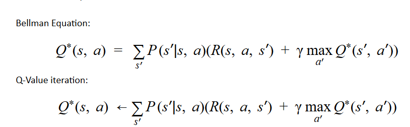

# Q-Value Iteration - Reinforcement Learning
Q-value is an exact method of solving a Reinforcement Learning problem. The goal of the task is to find expected utility starting in state s, taking action a, and (thereafter) acting optimally.

In mathmetical notations, we calculate this(below equation) for every state-action pair in State-Action space, given an MDP.

||
|:---------------------------------:|
|*[Src: UC Berkley 2017 Deep RL bootcamp Lecture 1 slides](https://drive.google.com/file/d/0BxXI_RttTZAhVXBlMUVkQ1BVVDQ/view)*|

## Task at Hand
The task is to maximize a reward in a world that consists of an agent that can navigate in 4 directions - North, South, East and West. With a 20% of equally likely chance of deviating to left or right from the action asked to perform.

||
|:--------------------------:|
|*[Src: UC Berkley 2017 Deep RL bootcamp Lecture 1 slides](https://drive.google.com/file/d/0BxXI_RttTZAhVXBlMUVkQ1BVVDQ/view)*|

## Usage
Modify `main.json` to suit your needs. The key names are self explanatory. Then run `python main.py`.

You can also create your own `<user-defined>.json` file with every paramter defined and then run `python main.py --json_path <user-defined>.json`
